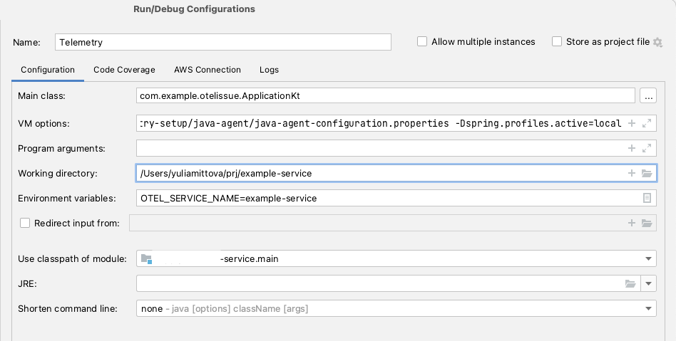
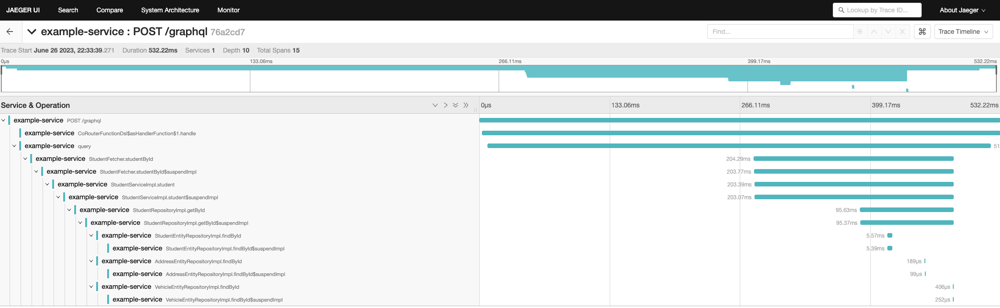
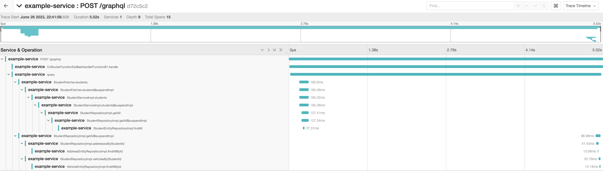

# OpenTelemetry Demonstration project

This is a demonstration project for coroutine Flow issue.

How to run:
1. Start docker container in this project: docker-compose up
2. Run using the following config:

3. Run any query from "http://localhost:8080/playground"

Query examples:
1) For fetching all students:
```graphql
query {
  students {
    id
    firstName
    surname
  }
}
```
2. For fetching specific student:
```graphql
query {
  studentById(input: {
    id: "f18beb15-3b23-4480-8fef-7c98030c29d5"
  }) {
    id
    address {
      id
      streetName
    }
    vehicle {
      id
      registrationNumber
    }
  }
}
```

I think the problem is in how OpenTelemetry is processing @WithSpan spans when Flow emits more than one item with delay (which is a typical situation when working with database).
If you fetch specific student (Flow will emit only one item) you will see the following picture:
.
But if you have Coroutine Flow which emits more than one item you will see spans which don't have correct parents and measured incorrectly:
.
